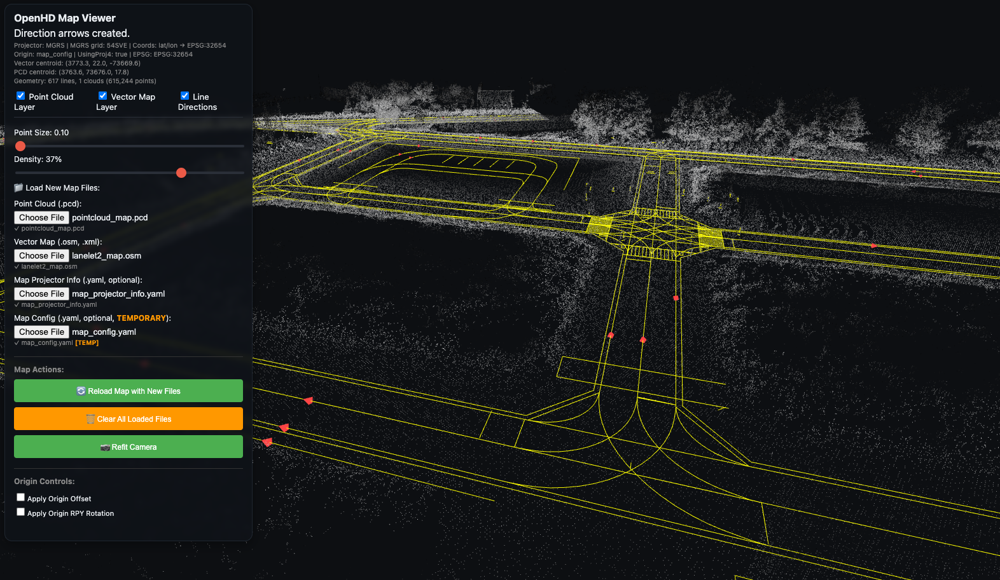

-----------------

This repository was created by [robomous.ai](https://robomous.ai).

OpenHD Map Viewer (MVP)
=======================



Purpose
- Visualize HD maps consisting of:
  1) Lanelet2 vector map (.osm)
  2) Point cloud (.pcd)

Stack
- Vite + TypeScript + React
- Three.js (latest with addons: PCDLoader, OrbitControls)
- fast-xml-parser for OSM parsing
- Optional: proj4 for coordinate projection

Prereqs
- nvm installed
- Node LTS 20.x
- Yarn installed globally

Quick Start
1) nvm install && nvm use
2) yarn install
3) Place your map files under:
   public/hd_maps/current/
   - vector_map.osm (or .xml)
   - pointcloud_map.pcd
   - map_projector_info.yaml (optional; defaults to MGRS when absent)
   - map_config.yaml (optional; TEMPORARY origin file used via UI loader)
4) yarn dev

Configuration and Files
- Required files:
  - vector_map.osm (or .xml Lanelet2)
  - pointcloud_map.pcd

- Optional files:
  - map_projector_info.yaml: describes map projector. If missing or invalid, the viewer now defaults to projector_type: MGRS. Example:
    ```yaml
    projector_type: MGRS  # or Local
    mgrs_grid: 54S        # optional
    ```
  - map_config.yaml (TEMPORARY): may contain `map_origin` for E/N/U normalization and optional RPY. This is intended to be loaded via the component UI file loader and is not required for startup.

## Module Structure

The OpenHD Map Viewer is organized as a self-contained module for easy decoupling:

```
src/modules/openhd/
├── OpenHDMapViewer.tsx    # Main React component
├── projection.ts          # Coordinate projection utilities
├── overlay.css            # Component-specific styles
├── index.ts              # Barrel exports
└── README.md             # Module documentation
```

## Component Usage

### Basic Usage
```tsx
import { OpenHDMapViewer } from "./src/modules/openhd";

<OpenHDMapViewer
  vectorUrl="/hd_maps/current/vector_map.osm"  // or .xml
  pointcloudUrl="/hd_maps/current/pointcloud_map.pcd"
  style={{ width: "100vw", height: "100vh" }}
/>
```

### Advanced Usage with Projection
```tsx
<OpenHDMapViewer
  vectorUrl="/hd_maps/current/vector_map.osm"
  pointcloudUrl="/hd_maps/current/pointcloud_map.pcd"
  projectionMode="proj4"
  proj4From="EPSG:4326"
  proj4To="EPSG:3857"
  vectorFlipY={true}
  defaultPointSize={0.1}
  defaultDensityPercent={40}
  showLineDirections={true}
  style={{ width: "100vw", height: "100vh" }}
/>
```

## Module Decoupling

To use this component in another project:

1. Copy the `src/modules/openhd/` folder to your project
2. Install dependencies: `three`, `fast-xml-parser`, `proj4` (optional)
3. Import: `import { OpenHDMapViewer } from "./modules/openhd"`

## Props Reference

| Prop | Type | Default | Description |
|------|------|---------|-------------|
| `vectorUrl` | string | - | URL to Lanelet/OSM XML file |
| `pointcloudUrl` | string | - | URL to PCD file |
| `projectionMode` | "identity" \| "proj4" | "identity" | Coordinate projection mode |
| `proj4From` | string | "EPSG:4326" | Source CRS for proj4 projection |
| `proj4To` | string | "EPSG:3857" | Target CRS for proj4 projection |
| `vectorFlipY` | boolean | true | Flip Y axis for vector alignment |
| `defaultPointSize` | number | 0.1 | Initial point cloud point size |
| `defaultDensityPercent` | number | 35 | Initial point cloud density |
| `showLineDirections` | boolean | false | Show minimal direction arrows on vector map lines (1 arrow per path) |
| `style` | CSSProperties | - | Container styling |

Notes
- For MVP, we assume map frames are compatible. If not, set projection to "proj4" and configure "from"/"to".
- Large point clouds may need tiling/streaming in the future.
- The component includes built-in controls for point cloud visualization and layer toggles.
- Map data files (*.osm, *.pcd) are gitignored to prevent large binary files in version control. 